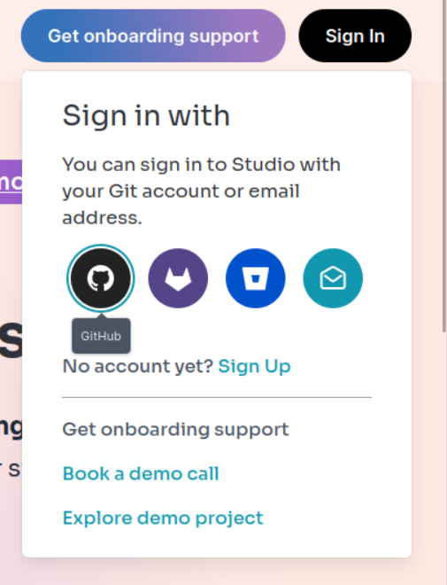
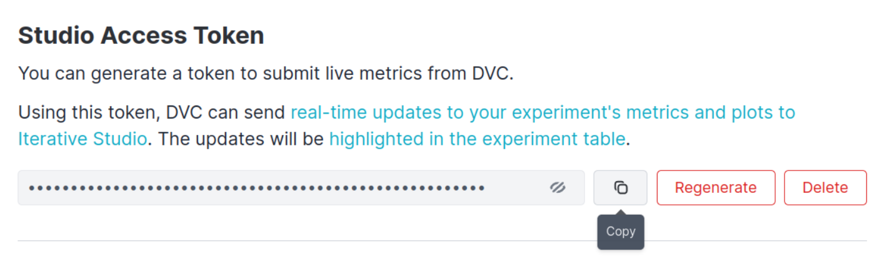

# Workshop - End2End GitOps ML pipeline

This is a Computer Vision (CV) project that solves the problem of segmenting out 
swimming pools from satellite images. 

We use a slightly modified version of the [BH-Pools dataset](http://patreo.dcc.ufmg.br/2020/07/29/bh-pools-watertanks-datasets/):
we split the original 4k images into tiles of 1024x1024 pixels.


## Initial setup

Python 3.8+ is required to run code from this repo.


1. Send the presenter the e-mail address associated with your GitHub account. You will be invited to collaborate on the workshop repository.
1. Clone the repository locally

    ```console
    $ git clone https://github.com/iterative/workshop-e2e-gitops-ml
    $ cd workshop-e2e-gitops-ml
    ```

1. Now let's install the requirements and create a virual environment. You can use the included makefile and simply call

    ```console
    $ make venv
    ```

1. (Optional) Connect your account to DVC Studio for live experiment sharing

    The worskhop host should invite you to a team in DVC Studio using the GitHub-associated e-mail address. You can then simply use your GitHub account to log in to Studio.

    


    Once you are signed-in, click on the icon in the top-right corner of the Studio UI and select Profile. Scroll down to Studio Access Token and copy it 

    


    Then call the following command with `***` replaced by your token
    ```console
    dvc config --global studio.token ***
    ```
    This will allow dvc to communicate with Studio and share progress of live (ongoing) experiments with others.

## 1. Getting raw data

Import the raw data with dvc from our public dataset registry:

```console
$ dvc import https://github.com/iterative/dataset-registry use-cases/pool_data -o data/pool_data
```

## 1. Running your own experiments during the workshop

1. Open the `params.yaml` file in the root of the repository and edit some values
1. Run `dvc exp run`
1. Observe the results in Studio, in the VS code extension or in the command line
1. Persist the experiment and add it to the (local and remote) git history by calling
    ```console
    dvc exp push origin exp-name
    ```
    with `exp-name` replaced with your experiment name.
